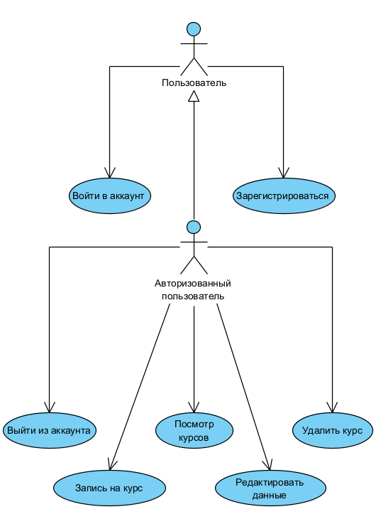

# Диаграмма вариантов использования

 
  
# Глоссарий

| Термин | Определение |
|:--|:--|
| Пользователь | Человек, использующий приложение |
| Авторизованный пользователь | Пользователь, прошедший авторизацию в приложении |
  
# Поток событий 

# Содержание
1 [Актёры](#actors)  
2 [Варианты использования](#use_case)  
2.1 [Войти в аккаунт](#sign_in_to_your_account)  
2.2 [Зарегистрироваться](#sign_up)    
2.3 [Просмотр курсов](#sign_in_as_visitor)   
2.4 [Редактировать данные](#find_film_in_list)  
2.5 [Удалить курс](#find_film_info)  
2.6 [Записаться на курс](#view_film_info)     

<a name="actors"/>

# 1 Актёры

| Актёр | Описание |
|:--|:--|
| Пользователь | Человек, использующий приложение |
| Авторизованный пользователь | Пользователь, прошедший авторизацию в приложении |

<a name="use_case"/>

# 2 Варианты использования

<a name="sign_in_to_your_account"/>

## 2.1 Войти в аккаунт

**Описание.** Вариант использования "Войти в аккаунт" позволяет пользователю войти в учётную запись.  
**Предусловия.** Пользователь выбрал способ "Вход" для входа в приложение.  
**Основной поток.**
1. Приложение отображает окно входа в аккаунт;
2. Пользователь вводит данные;
3. Пользователь подтверждает ввод;
4. Приложение запоминает имя пользователя и загружает его данные;
5. Приложение скрывает окно входа в аккаунт;
6. Вариант использования завершается.

<a name="sign_up"/>

## 2.2 Зарегистрироваться

**Описание.** Вариант использования "Зарегистрироваться" позволяет пользователю создать свой аккаунт в приложении.  
**Предусловия.** Пользователь захотел зарегистрироваться в приложении, выбрав пункт меню "Регистрация".  
**Основной поток.**
1. Приложение отображает окно регистрации, в котором запрашивает у пользователя ввод данных;
2. Пользователь вводит данные;
3. Пользователь подтверждает ввод;
4. Приложение проверяет введённое имя на совпадение с именами уже зарегистрированных пользователей. Если совпадение выявлено, выполняется альтернативный поток А1;
5. Приложение создает аккаунт пользователя в базе данных;
6. Приложение скрывает окно регистрации;
7. Вариант использования завершается.

**Альтернативный поток А1.**
1. Приложение сообщает пользователю, что пользователь с таким именем уже существует;
2. Приложение запрашивает у пользователя ввод другого имени;
3. Возврат к п.2 основного потока.

<a name="sign_in_as_visitor"/>

## 2.3 Просмотр курсов

**Описание.** Любой пользователь может просматривать свои курсы.   
**Основной поток.**
1. Приложение отображает окно курсов;
2. Пользователь выбирает курс.
3. Приложение отображает данные о курсе.
4. Вариант использования завершается.

<a name="view_film_list"/>

<a name="find_film_in_list"/>

## 2.4 Редактировать данные

**Описание.** Вариант использования позволяет авторизованному пользователю редактировать созданные им данные.  
**Предусловия.** Пользователь нажал на кнопку редактирования в профиле.  
**Основной поток.**
1. Приложение выводит окно редактирования данных;
2. Пользователь изменяет необходимые данные;
3. Пользователь подтверждает ввод;
4. Приложение обновляет данные;
5. Вариант использования завершается.

<a name="find_film_info"/>

## 2.5 Удалить курс

**Описание.** Вариант использования позволяет авторизованному пользователю удалить свой курс.  
**Предусловия.** Пользователь нажал кнопку "Удалить" для своего курса.  
**Основной поток.**
1. Приложение удаляет курс из списка;
2. Вариант использования завершается.

<a name="view_film_info"/>

## 2.6 Запись на курс

**Описание.** Вариант использования позволяет авторизованному пользователю записываться на курсы.  
**Предусловия.** Пользователь нажал на кнопку "Записаться".  
**Основной поток.**
1. Приложение выводит окно записи на курс;
2. Пользователь подтверждает запись;
3. Приложение сохраняет данные о записи;
4. Вариант использования завершается.
